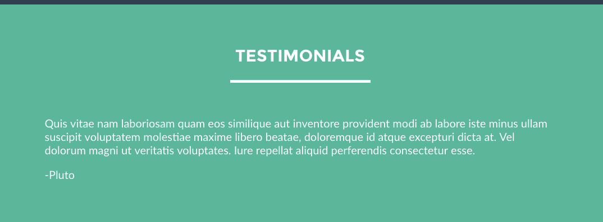

### A `README.md` file with explanations of Technologies used.
	- HTML5, 
	- CSS, 
	- JavaScript, 
	- JQuery, 
	- Bootstrap 4.0

- RoadBlocks and How I resolved them:
Description: Here are some trouble I ran into and how I resolved them and some are still unsolved problems.
	1) How to quickly jump to different section of the page:
	 
		* href, section id matching with project.
	

	2) Smooth scrolling: after some research I found out 

	3) How to set font-size and which unit to use?  
	I decide to go with rem for overall body.  First set font-size: 62.5% which makes my percentage math really easy. Due to the default font-size = 16px.
	62.5% of 16px = 10px.  This makes my Math for font rem % calculation really simple. (everything based on 10)  
	Below explains in greater detail why.
	

	4) Grid and flexbox
	I wanted to make my site responsive therefore, I want to make it painless by using CSSGrid and flexbox.
	

- Your process/approach.
	Process, approach: First, I drew an outline of a site that meets all the min specs on piece of paper.
	Second, I build the semantic HTML structure.
- Unsolved problems.
- Your biggest wins and challenges.
#### challenges: 
- I want the nav bar hover to fill in all the space but at first it used to 

#  Unit 1 Project Build an About Me Site

Description:

#### Overview

This project will give you a chance to use the skills we've learned in class to create a site that highlights the skills and projects you'll be working on in WDI. You'll get a chance to use JavaScript to tackle interactions such as an image slider, a responsive hamburger menu, and quotes that fade in and out on a timer.

Make sure to customize the design and content of the website to make it your own.

You will be working individually for this project, but we'll be guiding you throughout the process and helping as you go.

---

#### Requirements

Your work must:

- Use semantic markup for HTML and CSS, adhering to best practices.
- Use Flexbox/Grid to create a multi-column layout.
- Be completely responsive.
- Include separate HTML/CSS/JavaScript files.
- Stick with the KISS (Keep It Simple Stupid) and DRY (Don't Repeat Yourself) principles.
- Use JavaScript or jQuery for DOM manipulation.
- Be deployed and accessible online.

---

#### Necessary Deliverables

- A working site, built by you, hosted somewhere on the internet.
- A Git repository, hosted on your personal GitHub, that includes a link to your hosted site and frequent commits dating back to the beginning of the project.
- A `README.md` file with explanations of:
  - Technologies used.
  - Your process/approach.
  - Unsolved problems.
  - Your biggest wins and challenges.
- Screenshots of the snippets of code you used to solve particularly interesting problems (think code highlights).
- An in-class demo of the site that shows off the interactions you worked on.

- A carousel whose images slide to the side on a timer, along with indicators that the user can click to navigate to a particular project.

	
	- Use the internet to find great carousels! [BootStrap Version](https://getbootstrap.com/docs/4.0/components/carousel/) [Materialize Version](https://materializecss.com/carousel.html)

- Functionality that allows a carousel image to enlarge in a lightbox when the user clicks on it. Clicking anywhere on the screen when the lightbox is open should close the lightbox.

	

- Nav bar functionality that allows the page to scroll smoothly to the correspending section when a nav item is clicked.

	

- Nav bar functionality that highlights a nav item when the user scrolls to the corresponding section of the page.

	

- A testimonials section in which testimonials rotate in and out on a timer.

	

- A mobile nav that expands and collapses when a user clicks on the hamburger icon.

	

- Remember that you should customize the design of the site and make it your own. Here's a guideline for what the site could look like:

---

#### Starter Code

No starter code has been provided for this project, as you will be building your site from scratch. As an option, you can use the [HTML5 Boilerplate](https://html5boilerplate.com/) as a template to get started.

---
#### Suggested Ways to Get Started

- Don't hesitate to write throwaway code to solve short-term problems.
- Read the documentation for whatever technologies you use. **Most of the time — but not always — there is a tutorial you can follow, and learning to read documentation is crucial to your success as a developer.**
- **Write pseudocode before you write any JavaScript code.** Planning out and thinking through interactions for a website is an important step that will save you time and effort when you start actually coding.
- Do not simply copy and paste code that you find online! It is OK (and highly encouraged) to use resources like Stack Overflow when thinking through interactions, but use these sites as a guide and then write the code on your own.

---
#### Hungry For More?

If you're looking for an extra challenge, try tackling some of the tasks below:

* Add validation to the contact form to make sure the user has filled out all required fields before submitting.
* Add a skills section featuring skills you have/will have learned in the class.
* Add functionality so that the carousel works with swiping on an iPad/iPhone.
* Utilize an API.

---
#### Need More Review?

- HTML/CSS
	- [Codecademy — Learn HTML/CSS](https://www.codecademy.com/learn/learn-html-css)
	- [Practice CSS Selectors with CSS Diner](https://flukeout.github.io/)
	- [Flexbox Froggy](http://flexboxfroggy.com/)

- JavaScript
	- [Eloquent JavaScript Textbook](http://eloquentjavascript.net/)
	- [30 Days to Learn jQuery](https://code.tutsplus.com/courses/30-days-to-learn-jquery)
	- [JavaScript Timers](https://developer.mozilla.org/en-US/Add-ons/Code_snippets/Timers)
	- [Codecademy — Learn JavaScript](https://www.codecademy.com/learn/learn-javascript)

***

---
#### Project Feedback + Evaluation

Based on the requirements above, you can earn a maximum of **24** points on this project. Your instructors will score each of your technical requirements using the scale below:

|      | Incomplete | Does not Meet Expectations |  Meets Expecatations | Exceeds Expectations |
|--- |---| --- | ---| --- |
| Code Quality/ Readability (Uses semantic markup for HTML and CSS, adhering to best practices, Sticks with the KISS (Keep It Simple Stupid) and DRY (Don't Repeat Yourself) principles, Includes separate HTML/CSS/JavaScript files) |     |    |     |     |
| Technical Requirements (Uses Flexbox to create a multi-column layout, Is completely responsive, Uses JavaScript or jQuery for DOM manipulation, Includes the interactions listed under "Necessary Deliverables") |     |    |     |     |  
| Project Workflow/ Application Flow (Is the flow between different pages or different sections of a page logical?) |     |    |     |     |
| Deployment (Is deployed online?) |     |    |     |     |

This will serve as a helpful overall gauge of whether or not you've met the project goals. It can also help you identify where to focus your efforts for the next project!

#### Project Grade

Based on the requirements above, you can earn a maximum of **24** points on this project. Your instructors will score each of your technical requirements using the scale below:

| Score | Expectations               |
|-------|----------------------------|
| 0     | _Incomplete_                 |
| 1     | _Does Not Meet Expectations_ |
| 2     | _Meets Expectations_         |
| 3     | _Exceeds Expectations_       |
